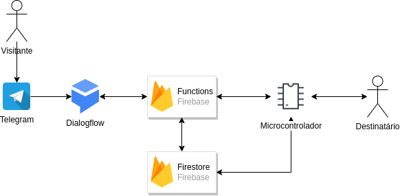

# Backend do Rudolph IOT

Bem vindo, esse projeto é o backend para o projeto do [RudolphIOT](https://github.com/kadu/rudolph-iot)

## Arquitetura

O visitante irá conversar com um BOT no telegram que será responsavel por fazer a recepção, perguntar qual o destinatário das mensagens e logo depois salvar a mensagem para determinada pessoa.

O destinatário (usando o hardware) poderá ver as mensagens deixadas para ele, consultando o banco de dados do Firebase.

O Firebase irá notificar o hardware do destinatário quando uma mensagem for encaminhada para ele, permitindo que o hardware mude a cor do led para avisar que existe uma nova mensagem!